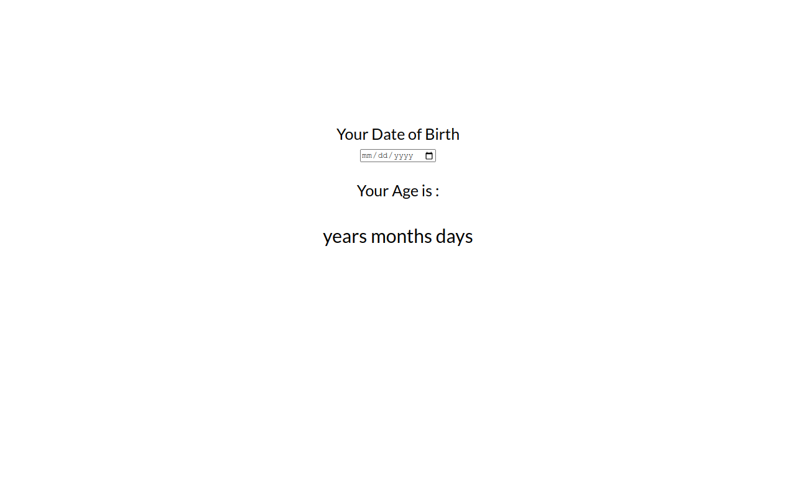

# Age-Calculator  

    This is just a simple web application which takes input as date of birth and shows their age in year, month and days.

[live link](https://age-calculator-app-js.vercel.app)  

[Source Code](https://github.com/manish-neemnarayan/age-calculator-app-js)  

  

## **Tools Used**  
    1. html
    2. CSS
    3. Javascript
    4. git
    5. live hosting
    